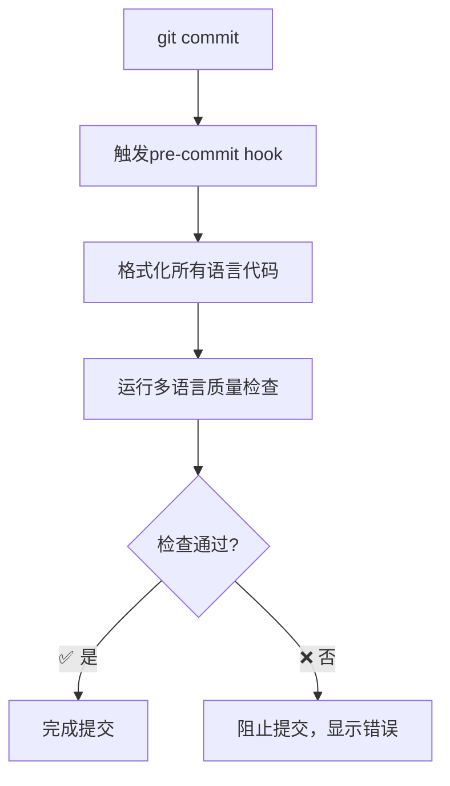

# 🚀 Multi-Language CI/CD Development Toolchain

## 🌟 项目概述

这是一个**企业级多语言CI/CD开发工具链**，从单一Go语言项目演化为支持**Go、TypeScript、Java、Python**四种主流开发语言的完整开发平台。

### 🎯 核心价值

在日常开发中，你是否遇到过这些痛点？

- **代码格式不统一**：每个人的IDE配置不同，格式化结果千差万别
- **质量检查不一致**：有些项目有lint，有些没有，标准各异
- **分支命名混乱**：`test-branch`、`fix`、`临时修改`等不规范命名满天飞
- **提交信息随意**：`fix bug`、`update`、`修改`等无意义提交信息
- **多语言项目管理复杂**：不同语言需要不同工具链，维护成本高

**本工具链解决方案**：
- ✅ **统一的代码格式化标准**
- ✅ **自动化的质量检查流程**
- ✅ **标准化的分支管理规范**
- ✅ **规范化的提交信息格式**
- ✅ **多语言项目的统一管理界面**

---

## 🏗️ 架构设计

### 智能项目检测
自动检测工作空间中的项目类型：

```
local-ci/
├── backend-go/          # Go后端项目 ✓
├── backend-java/        # Java/Maven后端项目 ✓  
├── backend-python/      # Python后端项目 ✓
├── frontend-ts/         # TypeScript前端项目 ✓
└── other-projects/      # 自动跳过未支持的项目
```

### 工具链支持矩阵

| 语言 | 格式化工具 | 质量检查工具 | 编译/构建 |
|------|-----------|------------|----------|
| **Go** | gofmt, goimports, gofumpt, golines | gocyclo, staticcheck, golangci-lint | go build |
| **TypeScript** | prettier | eslint, @typescript-eslint | tsc |
| **Java** | Spotless (Google Java Format) | **阿里巴巴P3C规范**, Checkstyle, SpotBugs, SLF4J日志 | mvn compile |
| **Python** | black | flake8, mypy | python -m py_compile |

---

## 🚀 快速开始

### 一键环境设置

```bash
# 克隆项目后，一键完成所有开发环境配置
make dev-setup
```

**自动完成**：
- ✅ 检测项目类型（Go/TypeScript/Java/Python）
- ✅ 安装所有语言的开发工具
- ✅ 配置多语言Git hooks
- ✅ 创建分支管理辅助脚本
- ✅ 显示完整使用指南

### 核心开发流程

```bash
# 1. 查看项目状态
make help

# 2. 格式化所有项目代码
make fmt

# 3. 运行所有质量检查
make check

# 4. 创建规范的功能分支
make new-feature name=user-authentication

# 5. 安全推送（验证分支名规范）
make safe-push
```

---

## 📋 命令速查表

### 🛠️ 环境管理
| 命令 | 功能 | 说明 |
|------|------|------|
| `make dev-setup` | **一键环境设置** | 首次使用必备，配置完整开发环境 |
| `make install-tools` | 安装多语言工具链 | 分语言安装开发工具 |
| `make check-tools` | 检查工具安装状态 | 验证工具链完整性 |
| `make project-status` | 显示项目检测结果 | 查看识别到的语言项目 |

### 🎨 代码格式化
| 命令 | 功能 | 支持语言 |
|------|------|---------|
| `make fmt` | **格式化所有项目** | Go + TS + Java + Python |
| `make fmt-go` | 格式化Go代码 | Go |
| `make fmt-ts` | 格式化TypeScript代码 | TypeScript |
| `make fmt-java` | 格式化Java代码 | Java/Maven (Spotless) |
| `make fmt-python` | 格式化Python代码 | Python |
| `make fmt-check` | 检查格式（不修改） | 所有语言 |

### 🔍 代码质量检查
| 命令 | 功能 | 支持语言 |
|------|------|---------|
| `make check` | **运行所有质量检查** | Go + TS + Java + Python |
| `make check-go` | Go代码质量检查 | Go |
| `make check-ts` | TypeScript代码检查 | TypeScript |
| `make check-java` | **Java质量检查（含P3C规范）** | Java/Maven |
| `make check-python` | Python代码检查 | Python |

### 🪝 Git Hooks管理
| 命令 | 功能 | 说明 |
|------|------|------|
| `make hooks-install` | **安装完整hooks** | pre-commit + commit-msg + pre-push |
| `make hooks-install-basic` | 安装基础hooks | 轻量级，仅格式化 |
| `make hooks-uninstall` | 卸载所有hooks | 临时禁用hooks |

### 🌿 分支管理
| 命令 | 功能 | 示例 |
|------|------|------|
| `make new-feature name=<名称>` | 创建功能分支 | `make new-feature name=payment` |
| `make new-hotfix name=<名称>` | 创建修复分支 | `make new-hotfix name=security-fix` |
| `make check-branch` | 检查分支命名 | 验证当前分支是否规范 |
| `make safe-push` | 安全推送 | 验证分支名后推送 |
| `make list-remote-branches` | 列出远程分支 | 显示规范/不规范分支 |

---

## 🎯 典型使用场景

### 场景1：新成员入职
```bash
# 新同事克隆项目后
git clone <project-url>
cd local-ci

# 一键完成环境配置
make dev-setup

# 验证安装结果
make help
```

### 场景2：多语言项目开发
```bash
# 查看项目检测结果
make project-status
# ✓ Go Backend       (backend-go/)
# ✓ TypeScript Frontend (frontend-ts/)
# ✓ Java Backend      (backend-java/)
# ✓ Python Backend    (backend-python/)

# 格式化所有语言代码
make fmt

# 运行所有语言质量检查
make check
```

### 场景3：标准化提交流程
```bash
# 创建规范分支
make new-feature name=oauth-integration

# 修改代码后，格式化和检查
make fmt && make check

# 提交（自动触发hooks）
git add .
git commit -m "feat: add OAuth2 authentication flow"
# hooks自动运行：格式化 → 质量检查 → 提交信息验证

# 安全推送
make safe-push
```

### 场景4：CI/CD集成
```bash
# 在CI环境中验证代码质量
make fmt-check    # 检查格式
make check        # 运行质量检查
make check-branch # 验证分支命名
```

---

## 🛡️ Git Hooks 工作流程

### Pre-commit Hook（提交前）


**检查项目**：
- 🎨 **代码格式化**：Go, TypeScript, Java, Python
- 🔍 **质量检查**：复杂度分析、静态检查、lint验证
- 📝 **自动修复**：格式化后的文件自动添加到提交

### Commit-msg Hook（消息验证）
**支持的提交类型**：
```
feat: 新功能
fix: 修复bug
docs: 文档更新
style: 格式化（不影响功能）
refactor: 重构
test: 测试相关
chore: 构建工具、依赖更新
```

**格式要求**：
```bash
# ✅ 正确格式
git commit -m "feat: add user authentication module"
git commit -m "fix(api): resolve CORS issue in payment endpoint"

# ❌ 错误格式  
git commit -m "fix bug"           # 缺少详细描述
git commit -m "更新代码"           # 非英文，无类型
git commit -m "update stuff"      # 类型错误
```

### Pre-push Hook（推送前）
**分支命名规范**：
- ✅ `master` - 主分支
- ✅ `develop` - 开发分支
- ✅ `feature-*` - 功能分支
- ✅ `hotfix-*` - 修复分支
- ❌ `test`, `temp`, `fix` 等不规范命名

---

## ⚙️ 高级配置

### 自定义工具版本
```makefile
# 在Makefile中修改版本锁定
STATICCHECK := staticcheck@2025.1.1
GOLANGCI_LINT := golangci-lint@v2.3.0
```

### 调整质量阈值
```makefile
# 修改复杂度阈值（默认10）
$(GOCYCLO) -over 15 $(GOFILES)

# 修改行长度限制（默认120）
$(GOLINES) -w -m 100 $(GOFILES)
```

### 项目特定配置
创建 `.eslintrc.js` (TypeScript)：
```javascript
module.exports = {
  extends: ['@typescript-eslint/recommended'],
  rules: {
    // 项目特定规则
  }
};
```

创建 `pyproject.toml` (Python)：
```toml
[tool.black]
line-length = 120
target-version = ['py39']

[tool.mypy]
strict = true
```

---

## 🔧 故障排除

### 工具安装问题
```bash
# Go工具安装失败
go env -w GOPROXY=https://goproxy.cn,direct
make install-tools-go

# Python环境问题（macOS）
python3 -m venv venv
source venv/bin/activate
make install-tools-python

# Node.js依赖问题
cd frontend-ts
npm install
cd ..
make install-tools-ts
```

### Git Hooks问题
```bash
# Hooks不执行
ls -la .git/hooks/
make hooks-install

# 临时跳过hooks
git commit --no-verify -m "emergency fix"

# 重新创建branch helpers
make create-branch-helpers
```

### 多项目工作空间
```bash
# 手动指定项目检测
HAS_GO=true make fmt-go
HAS_TS=false make fmt-ts

# 查看项目检测状态
make project-status
```

---

## 📊 工具链对比

### 传统开发 vs 本工具链

| 方面 | 传统方式 | 多语言CI/CD工具链 |
|------|---------|------------------|
| **环境配置** | 每种语言单独配置，步骤繁琐 | `make dev-setup`一键完成 |
| **代码格式化** | 手动运行不同工具 | `make fmt`统一格式化 |
| **质量检查** | 各语言分别检查 | `make check`全栈检查 |
| **Git管理** | 手动创建分支，命名随意 | 标准化分支创建和验证 |
| **团队协作** | 规范靠自觉，质量不一致 | 自动化hooks确保一致性 |
| **新人上手** | 学习成本高，配置复杂 | 零配置，即用即上手 |

---

## 🌐 扩展和集成

### CI/CD管道集成
```yaml
# GitHub Actions 示例
name: Multi-Language CI
on: [push, pull_request]

jobs:
  quality-check:
    runs-on: ubuntu-latest
    steps:
      - uses: actions/checkout@v3
      - name: Setup development environment
        run: make dev-setup
      - name: Check code quality  
        run: make check
      - name: Verify formatting
        run: make fmt-check
```

### IDE集成建议
- **VS Code**: 安装对应语言扩展，配置format on save
- **JetBrains**: 配置External Tools指向Makefile命令
- **Vim/Neovim**: 使用quickfix集成make命令

### 企业定制化
1. **Fork项目**：基于本项目创建企业版本
2. **定制规则**：修改lint规则、格式化配置
3. **添加语言**：按照现有模式扩展新语言支持
4. **集成工具**：添加企业内部质量工具

### ☕ Java阿里巴巴P3C规范升级

本工具链已全面升级至**阿里巴巴P3C代码规范**，基于《阿里巴巴Java开发手册》提供企业级Java代码质量检查。

#### 🔄 主要变更
- **PMD规则集**：从通用PMD规则升级为阿里巴巴P3C专用规则
- **规则数量**：从120行配置精简至49行，聚焦核心规范
- **检查维度**：覆盖10大代码规范类别
- **日志框架**：强制使用SLF4J+Logback替代System.out

#### 📋 P3C规则覆盖范围
- **注释规约**：强制类注释包含@author和@date
- **并发处理**：线程安全和同步机制规范
- **异常处理**：不允许捕获Exception，强制日志记录
- **命名风格**：严格的变量和方法命名规范
- **常量定义**：魔法值检测和常量化要求
- **集合处理**：ArrayList vs LinkedList最佳实践
- **ORM规约**：数据库操作安全规范
- **其他规约**：包含性能和安全相关检查

#### 🛠️ 验证P3C规则
```bash
# 运行Java质量检查（包含P3C规范）
make check-java

# 单独运行P3C检查
make check-pmd-java
```

#### 📝 常见P3C违规示例
```java
// ❌ 违规：使用System.out.println
System.out.println("Hello");

// ✅ 符合P3C：使用Logger
private static final Logger LOGGER = LoggerFactory.getLogger(MyClass.class);
LOGGER.info("Hello");

// ❌ 违规：魔法值
if (status.equals("active")) { ... }

// ✅ 符合P3C：常量定义
private static final String STATUS_ACTIVE = "active";
if (STATUS_ACTIVE.equals(status)) { ... }
```

---

## 📚 参考资源

### 官方文档
- [Go 官方文档](https://golang.org/doc/)
- [TypeScript 手册](https://www.typescriptlang.org/docs/)
- [Maven 用户指南](https://maven.apache.org/users/index.html)
- [Python 开发指南](https://docs.python.org/3/tutorial/)

### 规范和最佳实践
- [Conventional Commits](https://www.conventionalcommits.org/)
- [Git 分支管理策略](https://nvie.com/posts/a-successful-git-branching-model/)
- [Google 工程实践](https://google.github.io/eng-practices/)

### 工具链文档
- [golangci-lint 配置](https://golangci-lint.run/usage/configuration/)
- [ESLint 规则](https://eslint.org/docs/rules/)
- [Black 代码格式化](https://black.readthedocs.io/)
- [Prettier 配置](https://prettier.io/docs/en/configuration.html)
- [阿里巴巴Java开发手册](https://github.com/alibaba/p3c) - P3C规范完整说明

---

## 🤝 贡献指南

### 如何贡献
1. **Fork 本项目**
2. **创建功能分支**: `make new-feature name=your-feature`
3. **遵循代码规范**: `make fmt && make check`
4. **提交规范**: 遵循Conventional Commits
5. **创建Pull Request**

### 开发约定
- 新增语言支持时，遵循现有的模式
- 保持向后兼容性
- 为新功能添加文档和示例
- 确保跨平台兼容（Linux, macOS, Windows）

### 反馈和建议
- 🐛 **Bug报告**: 使用Issue模板详细描述问题
- 💡 **功能建议**: 说明使用场景和预期收益
- 📖 **文档改进**: 指出不清楚或缺失的内容

---

## 🏆 致谢

感谢所有为多语言开发工具链做出贡献的开发者和以下开源项目：

- [Go团队](https://golang.org/) - 卓越的工具链生态
- [Prettier](https://prettier.io/) - 统一的代码格式化
- [ESLint](https://eslint.org/) - JavaScript/TypeScript代码检查
- [Black](https://black.readthedocs.io/) - Python代码格式化
- [Maven](https://maven.apache.org/) - Java项目管理

---

## 📄 许可证

本项目采用 MIT 许可证 - 详见 [LICENSE](LICENSE) 文件

---

## 📞 联系方式

- **项目地址**: [GitHub Repository](https://github.com/your-org/multi-language-ci-cd)
- **问题反馈**: [Issues页面](https://github.com/your-org/multi-language-ci-cd/issues)
- **功能讨论**: [Discussions页面](https://github.com/your-org/multi-language-ci-cd/discussions)

---

**🚀 现在就开始使用多语言CI/CD工具链，提升你的开发效率！**

```bash
make dev-setup
```